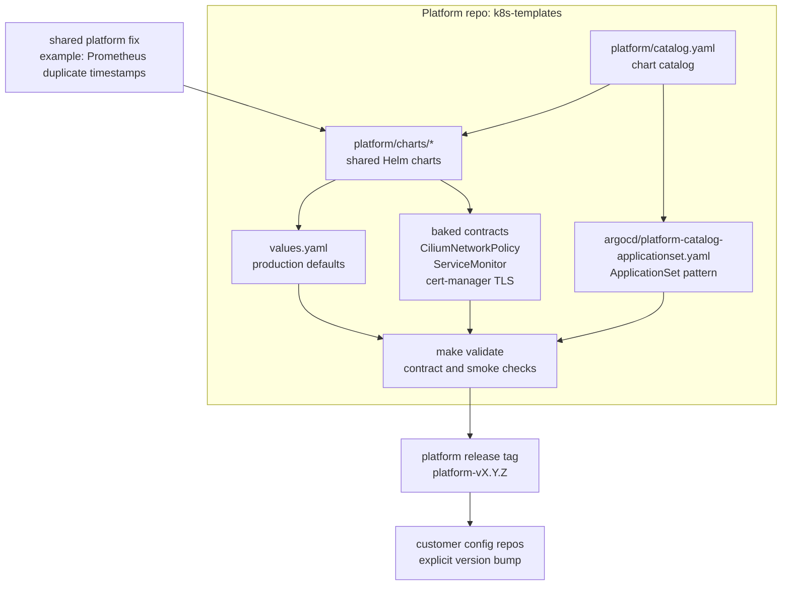
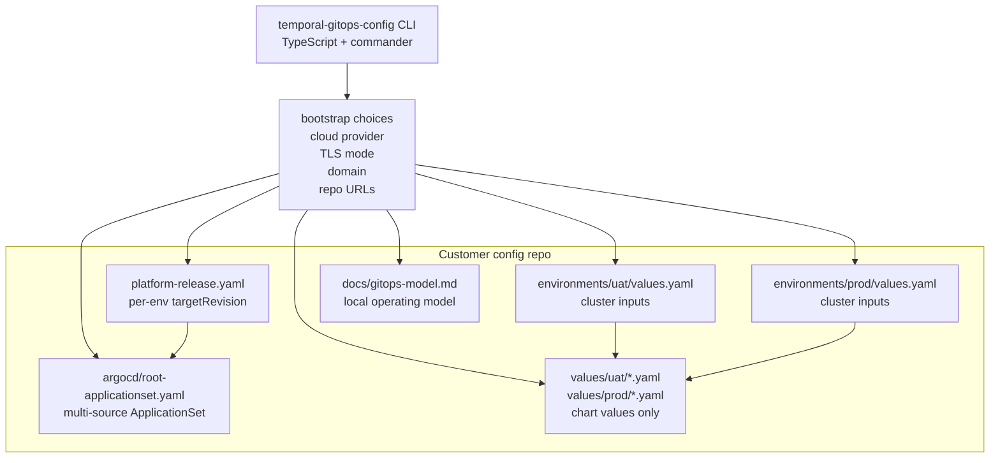
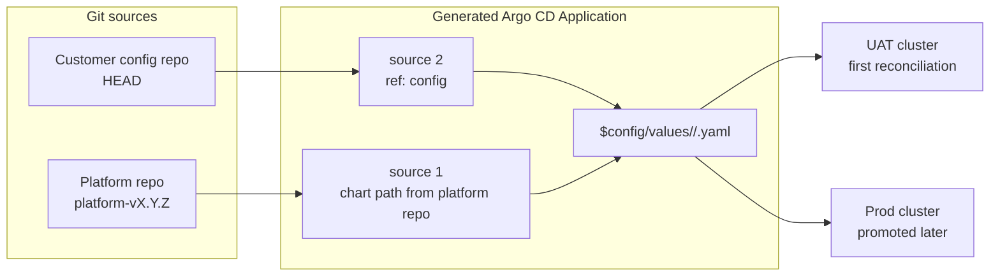
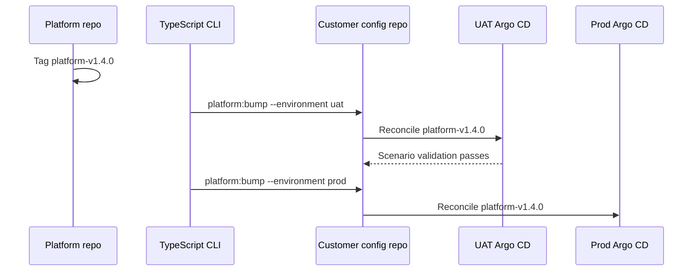

# Two-Repo GitOps Model

This CLI supports a sustainable split between a shared platform repo and one
config repo per customer.

## Repositories

### Platform repo

The platform repo is the shared source of production-tested platform behavior.
It owns:

- the Helm chart catalog and chart versions
- default values for each chart
- Cilium NetworkPolicies that ship with each app
- Prometheus ServiceMonitors that are pre-wired for observability
- cert-manager annotation conventions for HTTP-01, DNS-01, or self-signed TLS
- Argo CD ApplicationSet patterns and sync options

This repo should be releasable. A bug fix such as a Prometheus duplicate
timestamps fix lands once in the platform repo, is tagged, and then every
customer can adopt it by bumping the platform version in their config repo.

### Config repo

The config repo is generated by this CLI and is owned per customer. It contains
only values that genuinely vary by cluster or environment:

- domain names
- node counts
- AWS account roles
- Azure tenant, subscription, resource group, and workload identity IDs
- GCP project and workload identity values
- bare-metal load balancer pools
- TLS challenge mode and provider settings

Each generated config repo starts with two environments: `uat` and `prod`.

## How Argo CD Watches Both

The generated `argocd/root-applicationset.yaml` points Argo CD at:

1. the shared platform repo at an explicit `targetRevision`
2. the customer config repo as the environment-specific values source

Platform Helm chart sources use `$config/values/{{ .env }}/...` value files, so
cluster-specific choices stay in the config repo while the chart logic and
defaults stay in the platform repo.

The CLI generator keeps platform chart wiring in a catalog list. As the platform
repo grows beyond Redis, each chart entry gets its chart path, namespace prefix,
value file name, and config-value generator without changing the Argo CD
template shape.

That keeps common fixes centralized while preserving a reviewable adoption step
per customer and environment.

## Repository Diagrams

### Platform repo



### Config repo



### Argo CD reconciliation



### Version promotion



## Versioning And Release Flow

Use explicit platform release tags:

```sh
git tag -a platform-v1.4.0 -m "platform-v1.4.0"
git push origin platform-v1.4.0
```

Adopt a platform release by changing `platform-release.yaml` in the customer
config repo:

```yaml
spec:
  repoURL: https://github.com/example/platform.git
  environments:
    uat:
      targetRevision: platform-v1.4.0
    prod:
      targetRevision: platform-v1.3.9
  updatePolicy: explicit-version-bump
```

Use the CLI to make the adoption change consistently:

```sh
npx github:vlucaswang/temporal-gitops-config-cli platform:bump \
  --repo ./acme-temporal-config \
  --platform-version platform-v1.4.0 \
  --environment uat
```

Recommended promotion path:

1. Tag the platform release.
2. Use `platform:bump --environment uat` to update the customer config repo.
3. Open a config repo PR and let Argo CD reconcile UAT first.
4. Run Temporal scenario tests against UAT.
5. Promote the same platform version to Prod with `platform:bump --environment prod`.

## KubeAid Ideas Applied Here

KubeAid uses a config generator, GitOps reconciliation through Argo CD, curated
platform defaults, and multi-cloud cluster lifecycle conventions. This CLI
borrows those ideas in a narrower form:

- generate a customer-owned config repo from a guided CLI
- keep the platform catalog shared and versioned
- keep customer values small and auditable
- make multi-cloud differences explicit fields instead of ad hoc overlays
- rely on Argo CD to surface drift and reconcile declared state

This repo does not try to provision full Cluster API infrastructure yet. It
starts with the GitOps contract needed for sustainable platform release adoption.
